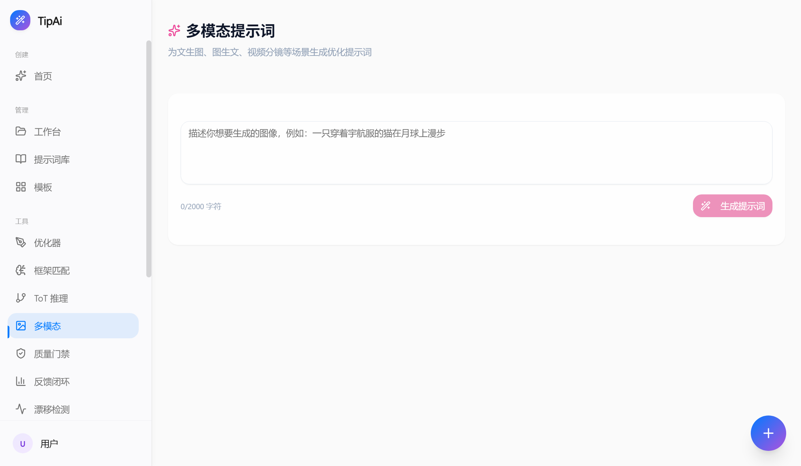

<div align="center">


# ✨ TipAi

**本地优先 · 全链路 AI 提示词工程平台**

> 从模糊需求到精准提示词，AI 驱动 · Rust 原生引擎 · 30+ 框架 · TPEMA 数字人表情控制

<a href="https://github.com/aitippro/TipAi/releases"></a>


</div>

---

## 📸 产品截图

<div align="center">

**首页 — AI 智能提示词工作台**


*输入模糊需求 → AI 意图分析 → 多轮澄清 → 框架匹配 → 精准提示词*

**多模态提示词引擎**



*文生图 / 图生文 / 视频分镜，上传参考图片或文件，AI 自动分析风格并生成专业提示词*

</div>

---

## 简介

**TipAi** 是一款本地优先、高性能的 AI 提示词工程桌面工具。输入模糊需求，AI 自动分析意图、多轮澄清、匹配最优框架、输出精准可用的提示词。所有数据存储在本地，无需注册登录。

### 为什么选择 TipAi？

- 🔒 **完全本地** — 数据永不离开你的电脑，AES-256-GCM 加密
- 🚀 **Rust 原生引擎** — 数据库 + AI 调用 + 加密下沉到 Rust，零序列化开销
- 🎨 **30+ 提示词框架** — RTF · CO-STAR · Chain-of-Thought · ReAct · LangGPT 等，覆盖全场景
- 🎭 **TPEMA 表情引擎** — 文本标点→FACS AU 映射，30fps 时间轴，4 种导出格式
- 🌐 **多模型支持** — DeepSeek / OpenAI / Claude / Ollama / Gemini
- 🛜 **零端口架构** — 无 HTTP 服务器，Electron 进程内 tRPC + Hono，无网络攻击面

---

## 快速开始

### 环境要求
- Node.js ≥ 22，npm ≥ 10
- Rust 1.85+（[安装指南](https://rustup.rs)）
- Windows 10+ / macOS 13+ / Linux

### 安装

```bash
git clone https://github.com/aitippro/TipAi.git
cd TipAi
npm install
npm run native:build    # 构建 Rust Native Addon
npm run dev             # 启动开发模式
```

### 直接下载

[📥 下载最新版本](https://github.com/aitippro/TipAi/releases) — Windows 便携版，解压即用

---

## 功能全景

| 模块 | 能力 |
|------|------|
| 🧠 **意图分析与澄清** | 11 领域 × 30+ 子领域分类，AI 多轮引导式需求澄清 |
| 🎯 **框架匹配引擎** | 30 框架知识图谱 + 5 维度评分 + Canvas 力导向图可视化 |
| ⚡ **OPRO 自动优化** | 多轮迭代优化，LLM-as-Judge 六维评分，自动 early stopping |
| 🎭 **TPEMA 表情控制** | 文本标点→FACS AU 映射，30fps 时间轴，4 种导出格式 |
| 📐 **30 个提示词框架** | RTF · CO-STAR · RISEN · CRISPE · Chain-of-Thought · ReAct · LangGPT 等 |
| 🔍 **质量门禁系统** | 12 项检查点（完整性/安全性/格式一致性等） |
| 📊 **反馈闭环** | 5 维评分 + 趋势分析 + 进化建议 |
| 🌳 **Tree of Thoughts** | BFS/DFS 多路径探索 + SVG 树形可视化 |
| 🤖 **Agent Swarm** | 5 角色 × 3 协作模式（顺序/并行/层级） |
| 🎨 **多模态引擎** | 文生图 / 图生文 / 视频分镜，支持参考图上传和文件解析 |
| 📝 **学术工具** | APA/MLA/GB7714/IEEE/Chicago 五种引用格式 |

---

## 技术栈

| 层级 | 技术 |
|------|------|
| 前端 | React 19 · TypeScript 5.9 · Vite 7 · Tailwind CSS 3 · shadcn/ui |
| API | tRPC 11 · Hono 4（in-process，无 HTTP 端口） |
| 数据库 | Rust Native Addon（rusqlite）主驱动 · better-sqlite3 回退 |
| 原生层 | Rust 1.85 · NAPI-RS · AES-256-GCM |
| 加密 | AES-256-GCM · PBKDF2-SHA256（600k 迭代） |
| 测试 | Vitest 4 · Playwright E2E |
| 构建 | Vite · esbuild · electron-builder · napi-rs |

---

## 项目结构

```
src/                      React 前端（22 个功能页面）
api/                      tRPC 路由 + 服务层
  lib/ai-service-v3/      30 框架目录中心 + AI Provider
  services/               澄清/优化/框架/多模态/质量/Agent/学术
native/                   Rust Native Addon (NAPI-RS)
  src/db/                 SQLite CRUD
  src/crypto/             AES-256-GCM
  src/ai/                 AI HTTP 客户端
electron/                 Electron 主进程 + IPC
db/                       类型定义 + 迁移
```

---

## 命令

```bash
npm run check              # TypeScript 类型检查
npm run test               # Vitest 单元测试（288 通过）
npm run build              # 生产构建
npm run build:desktop:win  # 构建 Windows 安装包
npm run build:desktop:mac  # 构建 macOS 安装包
```

---

## 质量

| 指标 | 状态 |
|------|------|
| 单元测试 | 288 项通过 |
| 类型检查 | ✅ 通过 |
| 生产构建 | ✅ 通过 |
| 表情引擎测试 | 54 项通过 |

---

## 致谢

本项目借鉴了以下开源项目和学术论文：

- [Prompt-Engineering-Guide](https://github.com/dair-ai/Prompt-Engineering-Guide) by DAIR.AI
- [LangGPT](https://github.com/EmbraceAGI/LangGPT) — 结构化提示词编程框架
- [OPRO: LLMs as Optimizers](https://arxiv.org/abs/2309.03409) — Yang et al., DeepMind 2023
- [Tree of Thoughts](https://arxiv.org/abs/2305.10601) — Yao et al., NeurIPS 2023
- [Self-Consistency](https://arxiv.org/abs/2203.11171) — Wang et al., ICLR 2023
- [Chain-of-Thought](https://arxiv.org/abs/2201.11903) — Wei et al., NeurIPS 2022
- [ReAct](https://arxiv.org/abs/2210.03629) — Yao et al., ICLR 2023

完整引用列表见 [docs/ATTRIBUTION.md](docs/ATTRIBUTION.md)

---

## 许可证

MIT License — 详见 [LICENSE](LICENSE.md)

<div align="center">

*Built by TipAi Team · 2026*

</div>
